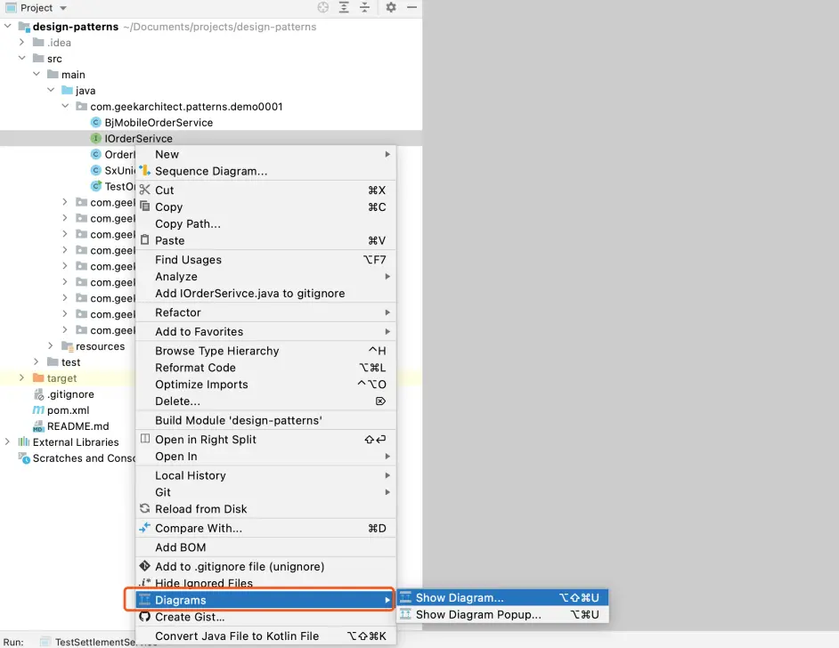
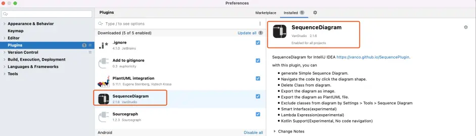
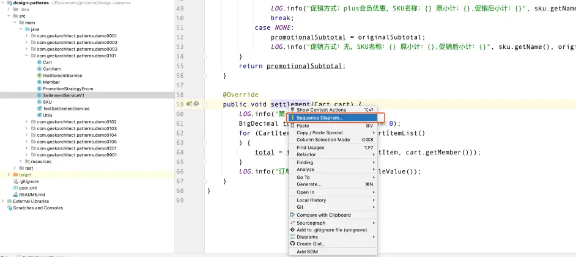
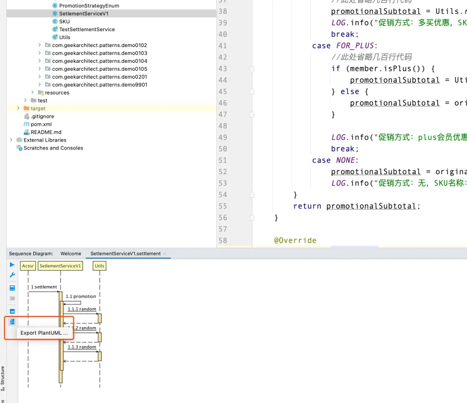
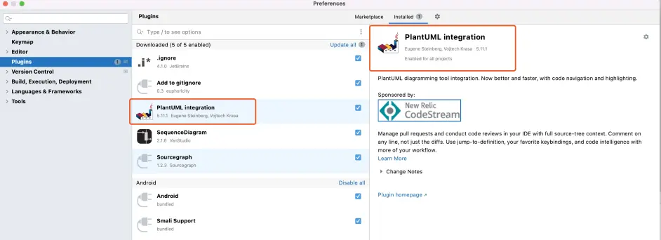
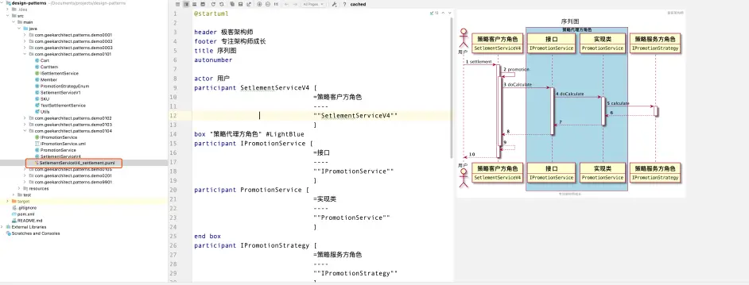

# 《架构师基本功之设计模式》相关代码，资料及工具说明

前言
各位朋友，大家好，近期，我推出了《架构师基本功之设计模式》系列分享，包括文章和视频，已经完成了模板方法模式，策略模式的分享。在开始分享之前，我原以为设计模式是比较偏冷门的，没想到这么多朋友关注，实在是出乎我的意料，对大家的关注和支持，我表示万分感谢，我将继续努力，做好后面的分享。

关于大家在评论区提到的相关代码，资料，和工具，今天统一回复如下，如有问题，欢迎大家在评论区留言。

大家的鼓励和支持，是我分享的动力。

代码及相关资料下载
由于github访问速度慢，还常常掉线，所以我还在国内的源代码管理平台gitee上同步了一份代码。两个平台代码同步时间基本一致，不区分先后。

github
https://github.com/geek-architect

gitee
https://gitee.com/geek-architect

工具
UML类图
idea内置插件，逆向工程生成类图

UML序列图
idea插件-SequenceDiagram

插件截图

1，逆向工程生成序列图

2，导出PlantUML格式文件

idea插件-PlantUML

https://plantuml.com/

该插件非常棒，支持的UML图形很多，轻量级插件，基于代码画图，简单高效。

插件截图

编辑序列图

极客架构师，专注架构师成长，我将持续分享架构师相关的文章和视频，我们下期见。

本文为我原创本文禁止转载或摘编 

作者：极客架构师 https://www.bilibili.com/read/cv16154224/ 出处：bilibili